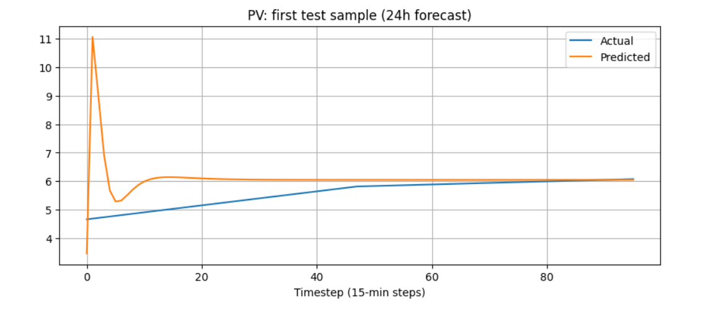
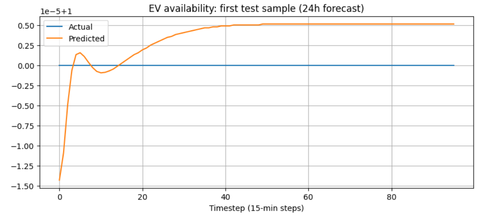

# Step 2B — PV & EV Multi-Step Forecasting (Seq2Seq LSTM)

Multi-step forecasting predicts **24 hours (96 timesteps)** ahead.

---

## ⭐ Objectives
- Seq2Seq LSTM with encoder–decoder  
- Predict next **96 samples** (24 hours)  
- Models built for:
  - Solar irradiance  
  - EV availability  

---

## 1️⃣ Architecture

```text
Encoder LSTM(128)
↓
RepeatVector(96)
↓
Decoder LSTM(64)
↓
TimeDistributed(Dense(1))

2️⃣ Solar Forecasting Results



3️⃣ EV Availability Forecasting Results



4️⃣ Interpretation
- EV availability forecasting performs extremely well
- PV irradiance is noisy and seasonal → higher error expected
- Forecasts feed into the MATLAB model to schedule charging

