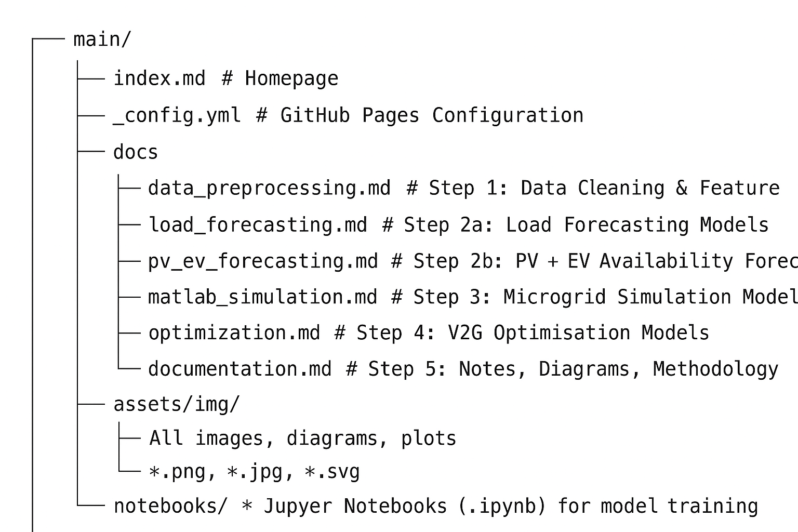

# 📁 Repository Structure

> 1. Data Preparation
(See: data_preprocessing.md)

Main tasks completed:
- Processed EV session JSON → CSV
- Load and PV datasets standardised
- All datasets resampled to 15-minute intervals
- Removed outliers, missing values, and duplicates

Feature engineering including:
- EV arrival/departure timelines
- Irradiance filtering and weather integration
- Weekend/weekday indicators
- Temperature and time-of-day features

This prepares a unified dataset for downstream forecasting models.

> 2. AI Forecasting Layer
(See: load_forcasting.md & pv_ev_forcasting.md)

Your AI layer currently covers:

- Load Forecasting
- LSTM baseline
- Stacked LSTM
- CNN-LSTM
- Bidirectional LSTM
- PV Generation & EV Availability Forecasting
- 24-step multi-horizon LSTM
- Seq2Seq encoder–decoder models
- Weather-enhanced PV forecasting

Model configuration:

- Window size: 96 timesteps (24 hours)
- Forecast horizon: 96 timesteps
- MinMax scaling
- Metrics: RMSE, MAE, R²

> 3. MATLAB/Simulink Energy System
(See: matlab_simulation.md)

Simulation model includes:

- PV subsystem
- Residential/community load subsystem
- EV charger (bidirectional)
- Battery storage with efficiency + degradation model
- Grid connection for import/export
- AI control interface for V2G dispatch decisions

This allows full co-simulation of the AI forecast-driven energy system.

> 4. V2G Optimisation Layer
(See: optimization.md)

Optimisation algorithms implemented/planned:
- Genetic Algorithm (GA)
- Rule-based scheduling
- Reinforcement Learning (DQN/DDPG)

Multi-objective optimisation targeting:

- Cost minimisation
- PV utilisation
- Peak shaving
- - Battery health preservation

> 5. Documentation & Diagrams
(See: documentation.md)

Contains:

- Full methodology
- Flow diagrams
- Dataset explanations
- Model descriptions
- Process documentation for the Q1 paper

🔧 How to Use This Repository
1. Notebooks

Full preprocessing and forecasting notebooks are in the notebooks/ folder.

2. Markdown Sheets

Each step is documented clearly in its own .md file so supervisors and reviewers can view each process directly on GitHub Pages.

3. Assets Folder

All diagrams and plots are stored in assets/ and referenced by Markdown pages in the site.

📌 Current Status

We have successfully completed:

- Step 1: Data Preparation
- Step 2a & 2b: Load, PV, and EV Forecasting
- GitHub Pages structured documentation
- Supervisor-approved research plan and article draft

We are currently working on:
- Step 3: MATLAB/Simulink system modelling
- Step 4: Optimisation (GA + RL)
